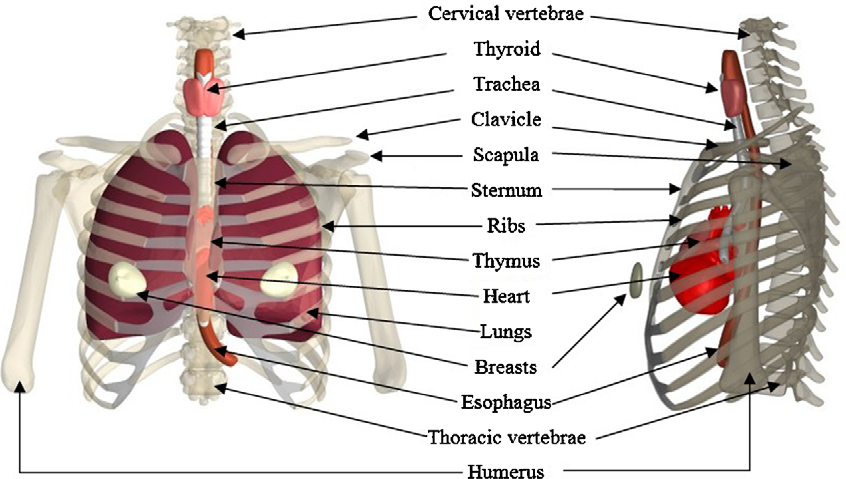

This repository contains Projectwork :arrow_down: undertaken for the partial fulfillment of Deep Learning Module and ETCS Creditpoints @OpenCampus.sh.

---

**<u>Implementation Status</u>**

- [x] Dataset Selection

- [x] [Exploration of Datasets](https://github.com/Mnpr/OC-DeepLearning/blob/main/ExplorationXray.ipynb)

- [ ] Data Preprocessing
  
  - [ ] Custom Dataset (torch.utils.data.Dataset)
  
  - [ ] Preprocessing
  
  - [ ] DataLoader

- [ ] Exploartion of Application Domain Challenges
  
  - [x] [Class Imabalance Problem](https://github.com/Mnpr/OC-DeepLearning/blob/main/ClassImbalance.ipynb)
  - [x] [Patient Overlap](https://github.com/Mnpr/OC-DeepLearning/blob/main/PatientOverlap.ipynb)
  - [ ] Dataset size

- [x] [Exploration of Evaluation Metrics](https://github.com/Mnpr/OC-DeepLearning/blob/main/EvaluationMetrics.ipynb)

- [ ] Binary Classifier

- [ ] Multi-class Classifier

- [ ] Transfer Learning
  
  - [ ] Densenet-121

- [ ] SOTA Candidate model Exploration

---

# Medical Radiology Assistance ( Chest X-ray )

**Objective :** To train and explore Deep learning models for Medical Radiology Assistance ( Classification and Detection of  Thorax Diseases) using Chest X-ray datasets.

[@Img: ](https://www.researchgate.net/publication/40686893_FASH_and_MASH_Female_and_Male_adult_human_phantoms_based_on_polygon_mesh_surfaces_I_Development_of_the_anatomy) [Male Thorax Region]

## :beginner: Index

1. Datasets

2. Implementation

3. Observation

4. Conclusion

5. References

## :diamond_shape_with_a_dot_inside: Datasets

- [NIH Clinical Center Chest x-ray datasets y | National Institutes of Health (NIH)](https://www.nih.gov/news-events/news-releases/nih-clinical-center-provides-one-largest-publicly-available-chest-x-ray-datasets-scientific-community)
  
  - :arrow_down: [Download Here](https://nihcc.app.box.com/v/ChestXray-NIHCC)
  - ⚠️ Incase of warning with Image folder !! :  run `python Utils/download.py`

## :computer: Implementaition

.

.

.

## :mag: Observation

.

.

.

## :black_nib: Conclusion

.

.

.

## :bookmark_tabs: References

- [1. ] [[1705.02315] ChestX-ray8: Hospital-scale Chest X-ray Database and Benchmarks on Weakly-Supervised Classification and Localization of Common Thorax Diseases](https://arxiv.org/abs/1705.0231
